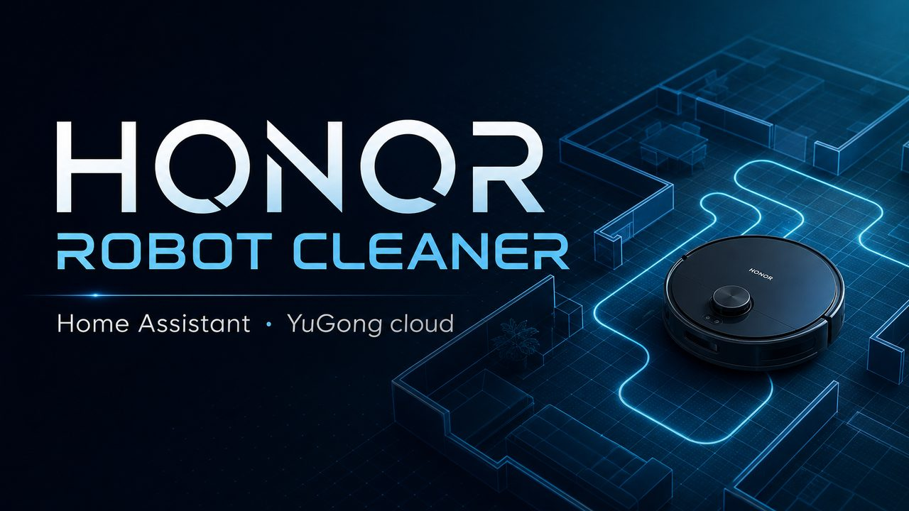
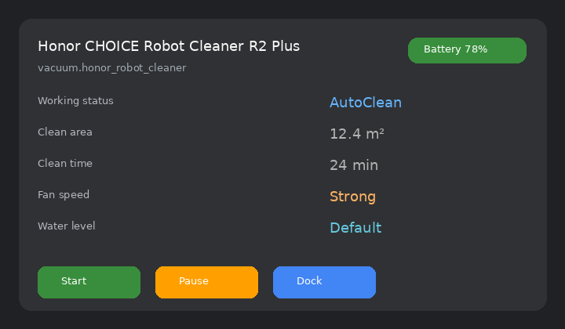
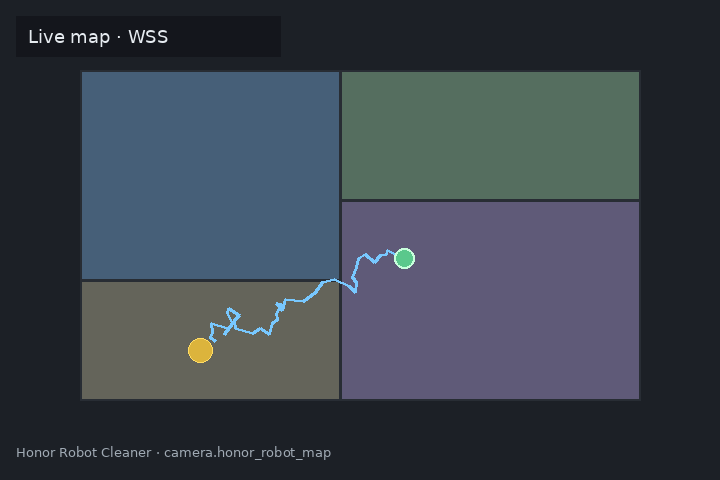

# Honor Robot Cleaner

<p align="center">
  
</p>

<p align="center">
  
</p>

<p align="center">
  <b>Неофициальная интеграция Home Assistant</b> для роботов-пылесосов<br/>
  <b>Honor Choice</b> (R2 Plus / DPIZ / <code>rob-01</code>) через облако YuGong / Grit<br/>
  (тот же бэкенд, что у плагина AI Space / Magichome).
</p>

<p align="center">
  
  
  
  
</p>

---

## Что умеет

| | |
|:--|:--|
| **Управление** | Старт / пауза / стоп / на базу, fan speed, spot, locate |
| **Карта** | Live-снимок через WSS (`map_data`), робот и док на плане |
| **Уборка по комнатам** | Сервис `clean_rooms` по `room_id` с карты |
| **Настройки** | Уровень воды, громкость, DND, carpet boost, подсветка |
| **Расходники** | Фильтр, щётки, салфетка — used / remaining |
| **Пульт** | Кнопки Move front / back / left / right / stop |
| **Вход** | Honor ID (телефон + SMS) с автообновлением JWT |

<p align="center">
  
  &nbsp;
  
</p>

> Облако, не локальный протокол. Запросы идут на  
> `https://honour.grit-cloud.com/prod/` (Европа) или `.cn` (Китай).

---

## Установка

### HACS (рекомендуется)

1. HACS → **Integrations** → ⋮ → **Custom repositories**
2. URL репозитория + категория **Integration**
3. Установить **Honor Robot Cleaner** → перезапустить Home Assistant
4. **Настройки → Устройства и службы → Добавить интеграцию → Honor Robot Cleaner**

### Вручную

```bash
# скопировать папку в config
cp -r custom_components/honor_robot_cleaner /config/custom_components/
```

Перезапустите HA и добавьте интеграцию через UI.

---

## Настройка

### Honor AI Space (рекомендуется)

Тот же логин, что в AI Space / Honor ID:

1. Телефон и пароль Honor ID  
2. Ссылка на капчу YiDun (открыть в браузере, будучи залогиненным в HA)  
3. SMS-код  
4. При необходимости — **Device ID** робота из AI Space → сведения об устройстве (длинный id вида `…bndpiz…`)

После входа HA хранит Honor SSO-сессию и **сам обновляет Grit JWT** (~24 ч) без телефона. Если SSO протух — один раз повторите Honor-логин.

### Вставить токен (advanced)

JWT или строка `plugin_account`. **Без автообновления** — удобнее Honor-логин.

### Пароль YuGong

Отдельный аккаунт RobotCleaner. Для чисто Honor-аккаунтов обычно `UserNotExist`.

---

## Сущности

### Основные

| Платформа | Примеры |
|-----------|---------|
| `vacuum` | уборка, пауза, док, fan Quiet / Normal / Strong / Max |
| `camera` | live map (WSS) |
| `sensor` | battery, working_status, clean area/time, error, firmware, online |
| `sensor` | расходники (filter / main brush / side brush / mop) |
| `select` | water level, active map |
| `number` | volume 0–100 |
| `switch` | continue clean, carpet boost, light, DND, … |
| `button` | spot, continue, locate, clear map, refresh rooms, move ∗ |

### Сервис `clean_rooms`

```yaml
service: honor_robot_cleaner.clean_rooms
target:
  entity_id: vacuum.honor_robot_cleaner
data:
  room_ids: [1, 2]
  times: 1
```

`room_id` берутся из атрибутов камеры карты после разбиения комнат в приложении.

---

## Параметры по умолчанию

| Ключ | Значение |
|------|----------|
| calling_code | `007` (+7) |
| region | из логина / `eu-central-1` |
| base_url | `https://honour.grit-cloud.com/prod/` |
| sub_type | `rob-01` |

---

## Скриншоты / ассеты

| Файл | Назначение |
|------|------------|
| [`images/banner.jpg`](images/banner.jpg) | шапка README / карточка |
| [`images/logo.png`](images/logo.png) | иконка проекта |
| [`images/screenshot-device.png`](images/screenshot-device.png) | пример карточки устройства |
| [`images/screenshot-map.png`](images/screenshot-map.png) | пример live map |

---

## Ограничения

- Неофициальный reverse-engineered API — может сломаться при смене бэкенда Honor/Grit.  
- Карта в HTTP-хранилище часто пустая; живой план идёт по **WSS**.  
- Комнаты появляются после разбиения карты в AI Space.  
- Не публикуйте пароли и JWT.

---

## English

Unofficial Home Assistant custom component for **Honor Choice** robot vacuums (R2 Plus / DPIZ / `rob-01`) via the YuGong / Grit cloud used by Honor AI Space.

**Features:** vacuum control, live WSS map camera, room cleaning service, water/fan/volume/DND, consumable sensors, remote-move buttons, Honor ID login with silent JWT refresh.

**Install:** HACS custom repository → restart → Add integration.  
**Auth:** Honor phone + captcha + SMS (recommended), or paste JWT / YuGong password.

Not affiliated with Honor. Use at your own risk.
