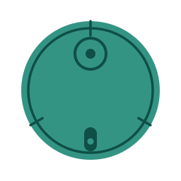

# Honor Robot Cleaner

  

  <strong>Honor Choice R2 Plus</strong> → Home Assistant 
  Неофициальная интеграция через облако YuGong / Grit

  
  
  

---

### Установка через HACS

1. Открой **HACS** → **Integrations**.
2. Справа сверху **⋮** → **Custom repositories**.
3. Вставь URL репозитория:

   `https://github.com/renattele/honor_robot_cleaner_ha`

4. Тип: **Integration** → **Add**.
5. Найди **Honor Robot Cleaner** → **Download**.
6. **Перезапусти** Home Assistant.
7. **Настройки → Устройства и службы → Добавить интеграцию** → **Honor Robot Cleaner**.

### Настройка

Вход через **Honor ID** (телефон → капча → SMS). JWT обновляется автоматически.

Device ID при необходимости: AI Space → сведения об устройстве.

### Возможности

- Управление уборкой и возврат на базу  
- Live-карта по WSS  
- Уборка по комнатам  
- Fan / water / volume / DND  
- Расходники и кнопки перемещения  

---

  Unofficial · not affiliated with Honor

